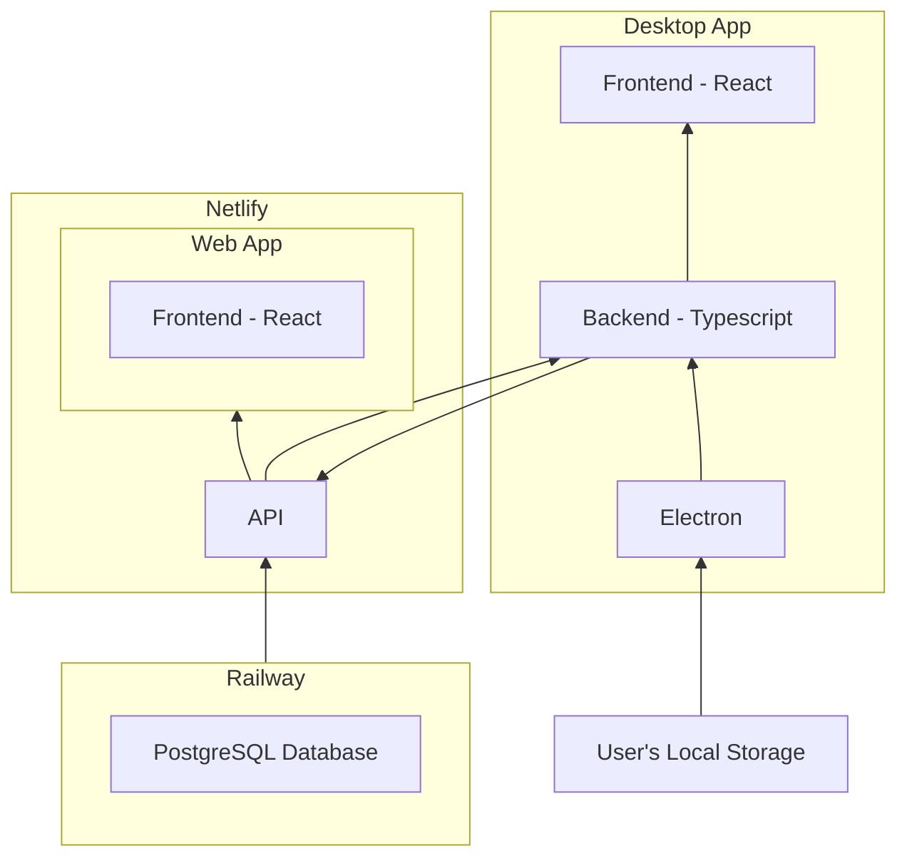

```mermaid
flowchart BT

    subgraph WebAppGraph[Web App]
    WAFE[Frontend - React]
    end

    subgraph DesktopAppGraph[Desktop App]
    DAFE[Frontend - React]
    DABE[Backend - Typescript]-->DAFE
    DAEl[Electron]-->DABE
    end

    DABE-->API


    DALS[User's Local Storage] -->DAEl

    subgraph Netlify

    API-->WebAppGraph
    end

    API-->DABE

    subgraph Railway
    PG[PostgreSQL Database]
    end

    Railway-->API

```